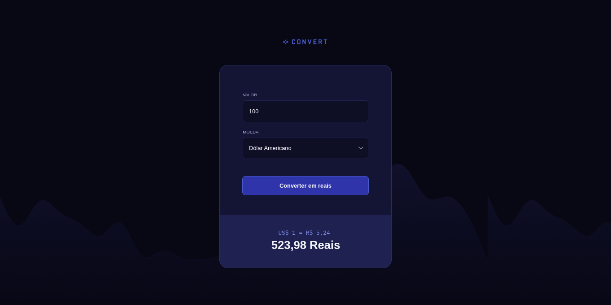

# Convert - Currency Converter

<div align="center">
  
</div>

<br>

<div align="center">
  
</div>

<br>

<p align="center">
  A web application that converts foreign currencies (USD, EUR, GBP) into Brazilian Real (BRL) using real-time exchange rates.
  <br>
  <br>
  <a href="#technologies">Technologies</a>&nbsp;&nbsp;&nbsp;|&nbsp;&nbsp;&nbsp;
  <a href="#features">Features</a>&nbsp;&nbsp;&nbsp;|&nbsp;&nbsp;&nbsp;
  <a href="#how-to-use">How to Use</a>&nbsp;&nbsp;&nbsp;|&nbsp;&nbsp;&nbsp;
  <a href="#license">License</a>
</p>

<p align="center">
  
  
</p>

<br>

## 💻 Project

**Convert** is a simple yet powerful currency converter developed during the **Rocketseat Fullstack Course**. 

Originally designed with static rates, this version has been enhanced to fetch **real-time data** from an external API, ensuring that the conversion is always up-to-date with the financial market.

## 🚀 Technologies

This project was developed with the following technologies:

- **HTML5**: Semantic structure.
- **CSS3**: Styling, Flexbox, and custom properties.
- **JavaScript (ES6+)**: DOM manipulation, Async/Await, and Fetch API.
- **AwesomeAPI**: Free API used to fetch current exchange rates.

## ✨ Features

- [x] **Real-time Conversion**: Fetches the latest bid price for USD, EUR, and GBP.
- [x] **Input Validation**: Restricts input to numbers only using Regex.
- [x] **Currency Formatting**: Automatically formats the output to Brazilian currency standard (pt-BR).
- [x] **Responsive Design**: Clean and modern interface adaptable to different screens.

## 📂 Project Structure

```text
├── img/                # Assets (Images, SVGs, and Preview)
├── index.html          # Main HTML structure
├── scripts.js          # Logic (API connection and DOM manipulation)
└── styles.css          # Application styling
```

## ℹ️ How to Use

To run this project locally, you don't need any complex installation (like Node.js), as it is built with Vanilla JS.

1. **Clone the repository:**
   ```bash
   git clone [https://github.com/andrepassoni/convert.git](https://github.com/andrepassoni/convert.git)
   ```
2. **Open the project:**
   Navigate to the project folder and open `index.html` in your favorite browser.

   > **Tip:** For a better experience, use the "Live Server" extension in VS Code.

## 🤝 Contributing

Contributions are welcome! If you'd like to improve this project:

1. Fork the project.
2. Create a new branch (`git checkout -b feature/AmazingFeature`).
3. Commit your changes (`git commit -m 'Add some AmazingFeature'`).
4. Push to the branch (`git push origin feature/AmazingFeature`).
5. Open a Pull Request.

## 📝 License

This project is under the MIT license. See the [LICENSE](LICENSE) file for more details.

---

<p align="center">
  Made with 💜 by <a href="https://github.com/andrepassoni">André Passoni</a> during the <a href="https://www.rocketseat.com.br/">Rocketseat</a> course.
</p>